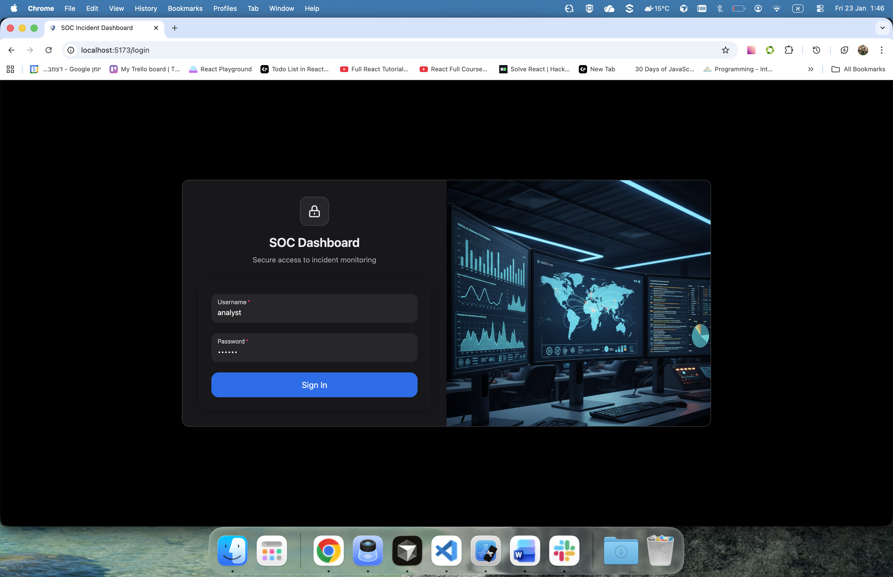
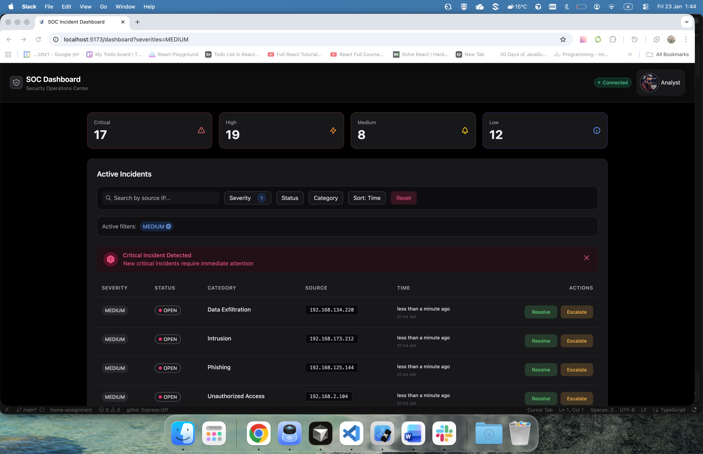

# SOC Incident Dashboard

A real-time Security Operations Center (SOC) incident management dashboard built as a home assignment.
The application demonstrates authentication handling, real-time data updates, and clean state management using React and Redux Toolkit.

---

## Screenshots

Login screen:


Dashboard:


---

## Features

- JWT-based authentication with automatic access token refresh
- Real-time incident updates using WebSocket (Socket.IO)
- Live connection status indicator (connecting / connected / disconnected)
- Incident management with optimistic status updates
- Filtering by severity, status, and category
- Sorting by timestamp or severity
- Search by source IP
- Visual emphasis for critical incidents
- Responsive layout for different screen sizes

---

## Prerequisites

- Node.js 18+
- npm (or compatible package manager)

---

## Setup Instructions

1. Clone the repository

```bash
git clone https://github.com/leF2881/frontend-home-assignment.git
cd frontend-home-assignment
```

2. Install dependencies

```bash
npm install
```

3. Run the development server

```bash
npm run dev
```

The application will be available at:
http://localhost:5173

---

## Redux Store Design

The Redux store is organized by feature to maintain clear separation of concerns and scalability.

- authSlice  
  Handles authentication state, including access token management, login/logout flow, and automatic token refresh via Axios interceptors.

- incidentsSlice  
  Manages incident data using a normalized structure (Redux Toolkit Entity Adapter), allowing efficient updates from both REST API calls and real-time WebSocket events. Optimistic updates are used to improve user experience.

- connectionSlice  
  Manages WebSocket connection state independently from authentication and data state, tracking connecting, connected, and disconnected statuses for accurate real-time feedback.

- filterSlice  
  Stores filtering, sorting, and search state. Filter values are synchronized with URL query parameters, enabling shareable and persistent views.

WebSocket side effects are handled outside Redux reducers through a dedicated service and a custom hook, keeping reducers pure and predictable.

---

This project focuses on correctness, clarity, and maintainable architecture rather than production deployment.
